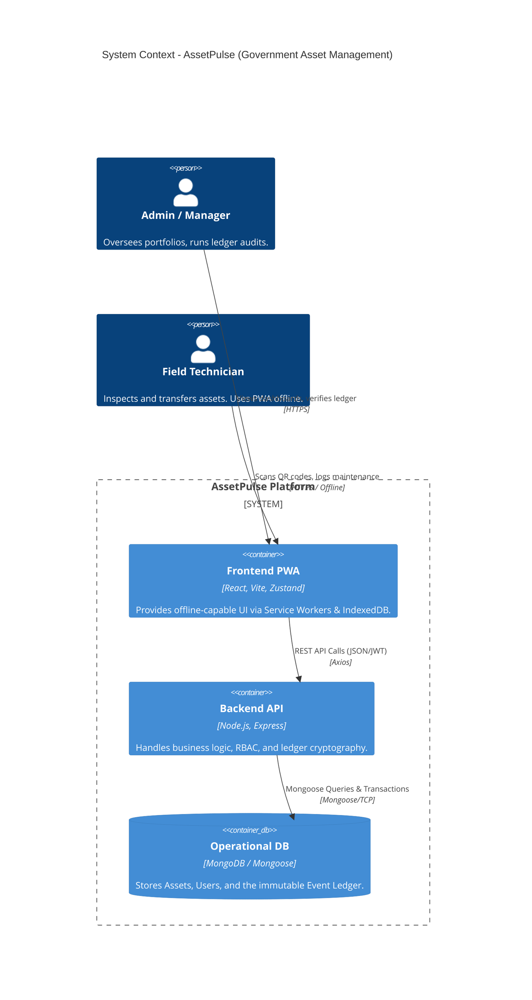
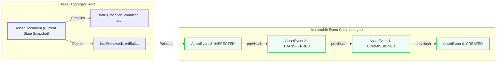
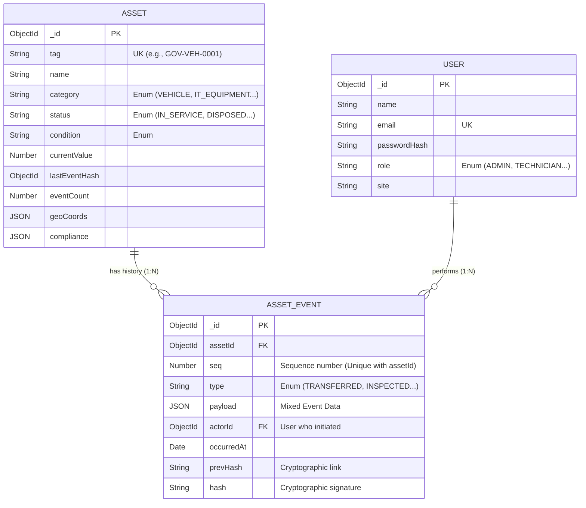
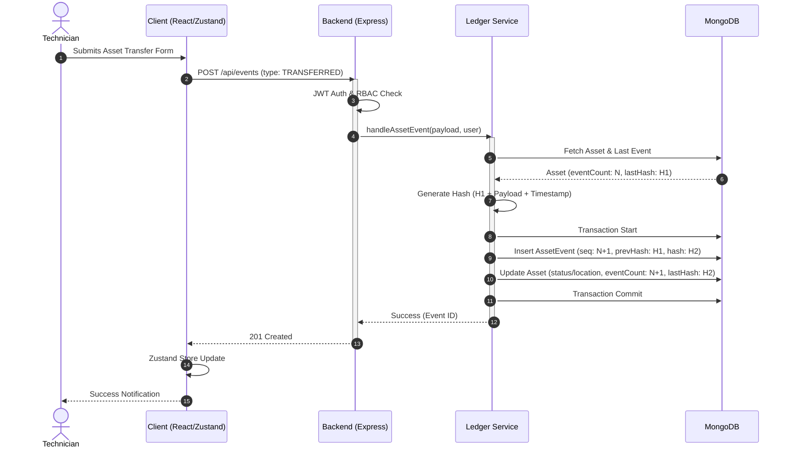
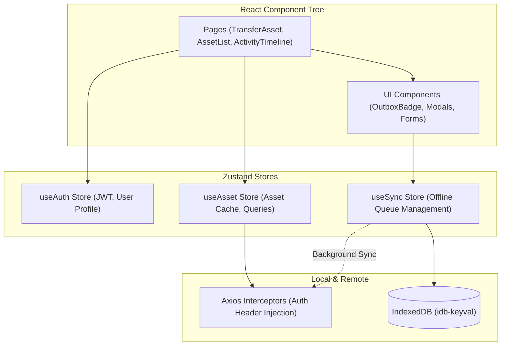

# Advanced System Architecture: AssetPulse (Gov)

This document provides a deep-dive technical architecture analysis of the AssetPulse system. It covers the system topology, the event-sourced verifiable ledger, the Entity Relationship Diagram (ERD), and complex workflow sequence diagrams.

---

## 1. Top-Level System Topology

The system adopts a modern 3-Tier architecture enhanced with Offline-First Progressive Web App (PWA) capabilities and an Event-Sourcing pattern for its core data integrity.

---

## 2. Event-Sourced Verifiable Ledger Architecture

Unlike a traditional CRUD application, AssetPulse utilizes an **Event-Sourced Cryptographic Ledger** for its assets. Every state change (transfer, maintenance, inspection) is appended as an immutable event linked by cryptographic hashes.

### Key Principles of the Ledger:
1. **Immutability**: `AssetEvent` documents are never updated or deleted.
2. **Cryptographic Chaining**: Each event calculates its `hash` based on the payload and the `prevHash` of the previous event in the sequence.
3. **Auditability**: The `/api/ledger/verify` endpoint dynamically traverses the chain to detect tampering or broken links.

---

## 3. Entity Relationship Diagram (ERD)

This ERD highlights the core database schema mapped through Mongoose models.

---

## 4. Sequence Diagram: Asset Transfer & Ledger Appending

This sequence shows the complex interaction when a user initiates a state-changing action (like transferring an asset), detailing how the client, API, and event ledger interact to ensure atomicity.

---

## 5. Client State Management Architecture

The frontend leverages a distributed state pattern using Zustand, separating UI concerns from API caching and domain logic.

