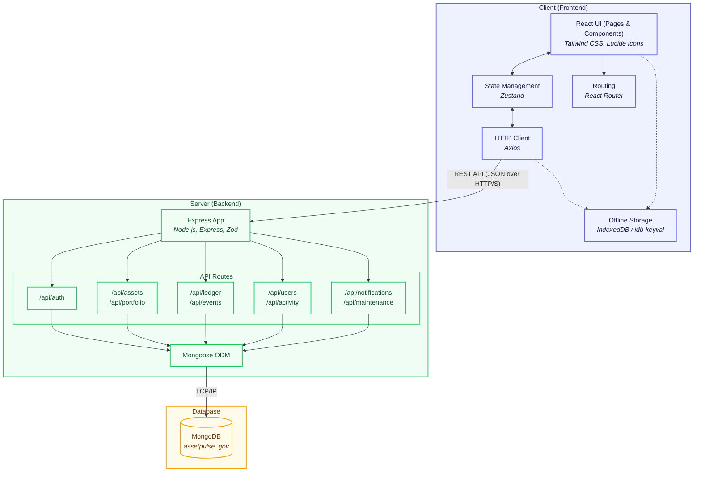

# Project Architecture

Here is the high-level architecture diagram for the AssetPulse (Government Asset Management) application, outlining the main components and how they interact.

### Technology Stack Details

#### 1. Frontend (Client)
- **Framework**: React with Vite for fast building and HMR.
- **Styling**: Tailwind CSS for utility-first styling.
- **State Management**: Zustand for lightweight global state.
- **Routing**: React Router DOM.
- **PWA & Offline**: Uses `vite-plugin-pwa` and `idb-keyval` (IndexedDB) for offline capabilities.
- **Other utilities**: `axios` for network requests, `html5-qrcode` / `qrcode.react` for QR code functionality, `recharts` for data visualization.

#### 2. Backend (Server)
- **Environment**: Node.js
- **Framework**: Express.js
- **Validation**: Zod for schema validation.
- **Authentication**: JWT (`jsonwebtoken`) and `bcryptjs` for secure password hashing.
- **Middleware**: `morgan` for logging, `cors` for Cross-Origin Resource Sharing.

#### 3. Database
- **Database**: MongoDB (accessed via the Mongoose Object Data Modeling library).
- **Primary Domain**: Asset management (`assetpulse_gov`), covering assets, portfolios, ledger (transactions/transfers), events, users, maintenance logs, and notifications.
